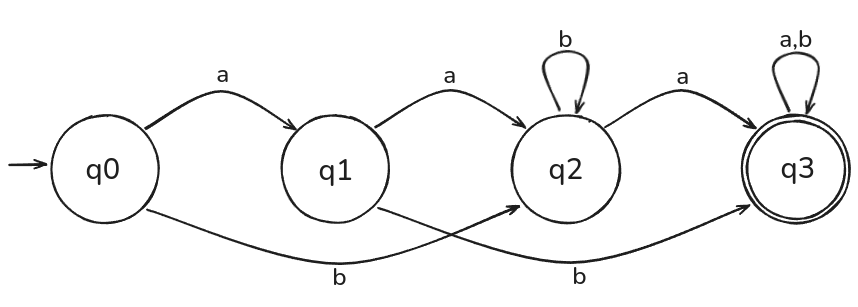

# DFA (Autômato Finito Determinístico - AFD)
Algorithm made to receive a [Deterministic finite automaton (DFA)](https://en.wikipedia.org/wiki/Deterministic_finite_automaton) and multiple words, returning the covered states for each symbol and if that word was accepted or not. Implemented in [Golang](https://golang.org/).

## Run 

Having Golang installed on your machine, at the root file of the project, type on your terminal:

```
go run main.go
```

## Input

Inputs are done solely by "example" text files of a specific structure. Each example file can be found at the `examples/` directory. Each example represents a set of parameters for the DFA, and finally, words that are going to be tested by it.



This DFA can be implemented with the following structure:

```
file: examples/example1.txt

0 1 2 3     // possible states
a b         // alphabet
1 2         // *
2 3         // * state transitions for each alphabet symbol
3 2         // *
3 3         // *
0           // initial state
3           // accept (or final) state(s)
5           // number of tested words
bbbbbbbbbb  // *
aaaaaaaaaa  // * tested words
aabbbbbbbba // *
bbbbbbbba   // *
abaaabb     // *
```

## Output

The program outputs the current analysed file, the current word being tested, the path of visited states for that word, and if the word was accepted or not. For the previous example file in the Input section, output should look like this:

```
ARQUIVO: example1.txt


Palavra: bbbbbbbbbb
Estados percorridos: 
 -> 0 -> 2 -> 2 -> 2 -> 2 -> 2 -> 2 -> 2 -> 2 -> 2 -> 2
Palavra foi aceita?: false

Palavra: aaaaaaaaaa
Estados percorridos: 
 -> 0 -> 1 -> 2 -> 3 -> 3 -> 3 -> 3 -> 3 -> 3 -> 3 -> 3
Palavra foi aceita?: true

Palavra: bbbbbbbba
Estados percorridos: 
 -> 0 -> 2 -> 2 -> 2 -> 2 -> 2 -> 2 -> 2 -> 2 -> 3
Palavra foi aceita?: true

Palavra: abaaabb
Estados percorridos: 
 -> 0 -> 1 -> 3 -> 3 -> 3 -> 3 -> 3 -> 3
Palavra foi aceita?: true
```

## Additional Information

Computer engineering assignment, pertinent to the Computer Theory class @ Unifei - Itabira.
June 2021.